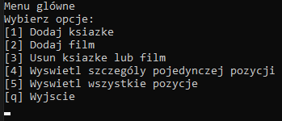

## MenuConsoleApp
 <br />
MenuConsoleApp is a console application that allows you to: <br />
- add information about books and movies, <br />
- display details of a single item, <br />
- display all items from the database, <br />
- search for items by text fragment, <br />
- navigate to the next/selected page, <br />
- delete selected items from the database. <br />
The database in this project is a file.

#### Setup/GettingStarted 
To use the application, download the repository, set your path to the JSON file (which serves as the database) and then run the application.

#### Technologie:
- .NET 7.0

#### Implemented Solutions 
1. Elimination of duplicate code: 
 
 Repeated code snippets have been extracted into separate classes and methods. For example: 
```C#
public class NamePath
{
    private readonly IUIDisplay _iUIDisplay;
    public NamePath(IUIDisplay iUIDisplay)
    {
        _iUIDisplay = iUIDisplay;
    }
    public void ShowNamePath(string? Name, List<string> ancestorNameList)
    {
        foreach (var parentName in ancestorNameList)
        {
            if (Name != null)
            {
                _iUIDisplay.Write(string.Join("/", parentName, Name));
            }
            else
            {
                _iUIDisplay.Write(string.Join("/", parentName));
            }
        }
    }

    public void ShowNamePath(List<string> ancestorNameList)
    {
        ShowNamePath(null,  ancestorNameList);
    }
}
```

This method is responsible for displaying name paths and is used in multiple components.

2. The SOLID principles have been followed in the project: <br />
- Single Responsibility Principle

The DatabaseFileStorage class is responsible only for saving and reading the database from a file. [Link to class](./MenuConsoleApp/MenuConsoleApp/Database/DatabaseFileStorage.cs) 

- Open-Closed Principle

The abstract class [UIMenu](./MenuConsoleApp/MenuConsoleApp/Menu/UIMenu.cs)
allows adding new functionalities by creating new classes (new menu classes) without modifying existing code.
Polymorphism is also applied: the Activate method contains different logic depending on whether it was used in a component or menu.

- Liskov Substitution Principle

After adding a new type of object (e.g., a game), whose class also inherits from CommonItemModel, the DisplayDetails() and ContainText() methods will work without any changes. Thanks to this, there is no need to check (use If statements) the type of a given object (each type of object has its own method implementation). These methods will work on every object created from a class that inherits from CommonItemModel. With further expansion of the project, there will be no need to add additional conditional statements.
```C#
 public void FindAndShowSingleElementDetails(int elementId, List<CommonItemModel> listOfElements)
 {
     var elementToDisplay = listOfElements.Where(c => c.ElementId == elementId).FirstOrDefault();
     if (elementToDisplay != null)
     {
         elementToDisplay.DisplayDetails();
     }
     else
     {
         _iUIDisplay.WriteLine("Obiekt o podanym Id nie istnieje");
     }
 }
```

- Interface Segregation Principle

Smaller, more specific interfaces adapted to the specific requirements of individual modules have been created. Each interface only implements one method.

```C#
public interface ISearchable
{
    public bool ContainsText(string userInput);
}
```
 3. The display of information to the user is handled by the IUIDisplay interface, while the IUIInput interface is responsible for input. Thanks to this, in case there is a need to change the method of displaying/retrieving information to something other than using the console, it is sufficient to implement a class with the same interface.
```C#
public class ConsoleUIDisplay : IUIDisplay
{
    public void WriteLine(string sentence)
    {
        Console.WriteLine(sentence);
    }

    public void WriteLine()
    {
        Console.WriteLine();
    }

    public void Write(string sentence)
    {
        Console.Write(sentence);
    }
}
```


#### Ideas for project development
-adding more types of stored data, <br />
-changing the database from a file to SQL, <br />
-converting the console application into a web application. <br />


